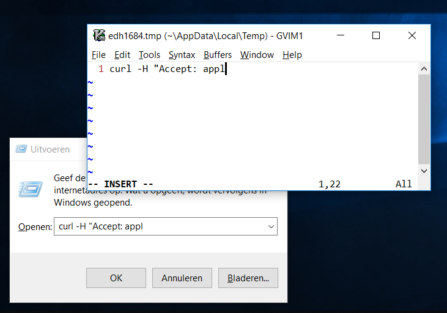

# Editor Here

Edit text fields with your favourite editor (WIP).

## Proof of concept

Download from the [Releases](https://github.com/sjmulder/edhere/releases)
page.

Major limitations:

 - Only native Windows (Win32) inputs work at this time.
 - Cannot yet be invoked with a hotkey. Instead, Editor Here waits 3 seconds
   after launching to let you focus on a text field. 

Usage: 

 1. Set the EDITOR environment variable to your favourite editor. Type
    "Change my environment variables" in the Start Menu to do this.
 2. Start edhere.exe.
 3. Focus on an input. Only native Windows (Win32) inputs work at this time.
 4. After a 3 second delay, Editor Here will launch the editor with the
    contents of the text field. Save and exit the file to have Editor Here
    move the text back to the field.

## Author

Sijmen J. Mulder (<ik@sjmulder.nl>)
